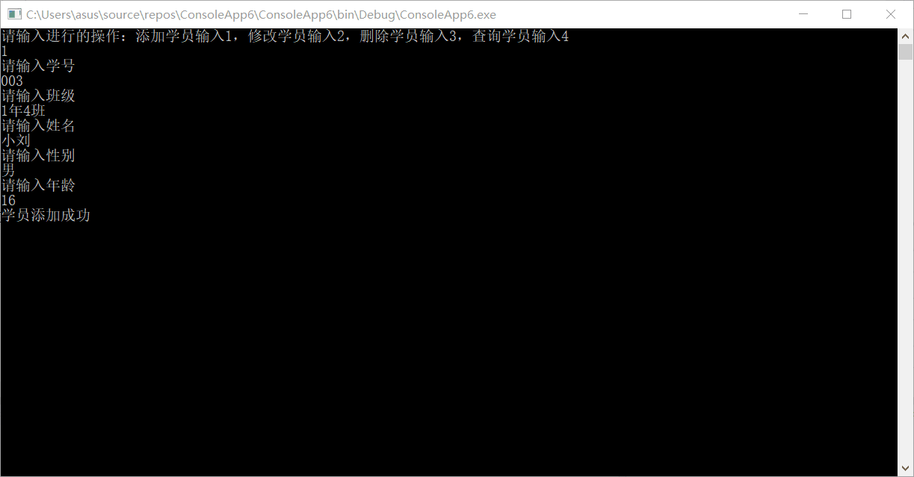
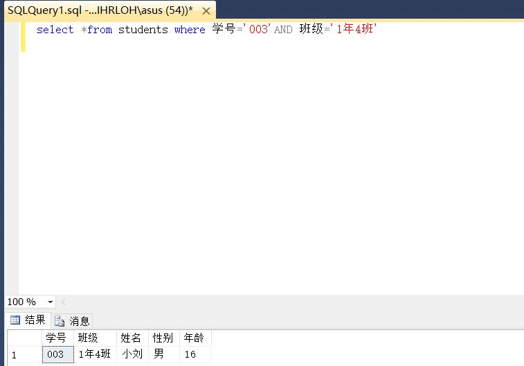
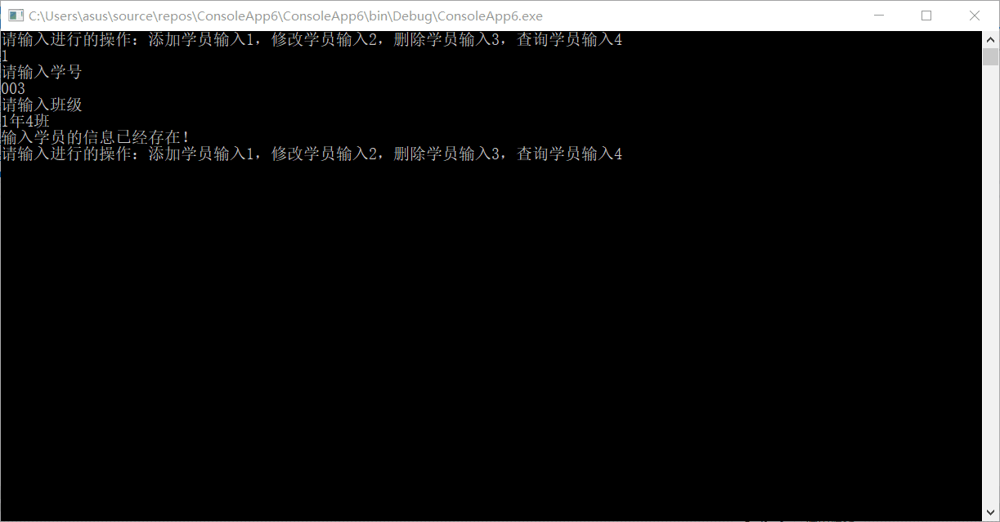

# 简易学生信息管理系统
## 1、系统简介
- #### 通过C#连接SQL Server中的数据库，实现对学生信息的增，删，改，查询等功能。
## 2、准备工作
- #### windows 10系统
- #### 安装 [Visual Studio](https://developer.microsoft.com/en-us/windows/downloads) (community 版本).
- #### 安装[SQL Server](https://docs.microsoft.com/zh-cn/sql/sql-server/sql-server-technical-documentation?toc=toc.json&view=sql-server-2017)
- #### Visual Studio[安装流程](tps://www.cnblogs.com/whuanle/p/8507478.html)
- #### SQL Server [安装流程](https://www.cnblogs.com/ios9/p/9527939.html)
## 3、代码介绍
### 3.1 代码思路
- #### 1、在SQL Server中创建一个数据库，在数据库中创建表格并输入学生信息（学号，姓名，性别，年龄，班级）
- #### 2、在C#中创建声明及链接实现与数据库的对接
- #### 3、在C#中利用if语句分别写出增，删，改，查询模块程序
- #### 4、在C#中创建一个判断是否已存在此学生信息的函数
### 3.2 具体代码如下

``` csharp
using System;
using System.Collections.Generic;
using System.Linq;
using System.Text;
using System.Threading.Tasks;
using System.Data;
using System.Data.SqlClient;
namespace ConsoleApp3
{
    class Program
    {
      //判断是否已经存在此学生信息的函数
        public static bool Exists(SqlConnection conn, string stu_no, string class_name)
          {
            string strSQL = "SELECT * FROM students WHERE 学号='" + stu_no + " 'AND 班级= '" + class_name + "'";
            SqlCommand comm = new SqlCommand(strSQL, conn);
            SqlDataReader dr = comm.ExecuteReader();
            
            if (dr.Read())
            {
                dr.Close();
                return true;
            }
            else
            {
                dr.Close();
                return false;
            }
          }
        static void Main(string[] args)
        {
           //创建声明
            SqlConnectionStringBuilder scsb = new SqlConnectionStringBuilder();
            scsb.DataSource = "127.0.0.1";
            scsb.IntegratedSecurity =true;
            scsb.InitialCatalog = "stu_db";
             //创建链接判断是否已经有链接
            SqlConnection conn = new SqlConnection(scsb.ToString());
            if (conn.State == ConnectionState.Closed)
            { conn.Open(); }
            while (true)
            {
                Console.WriteLine("请输入进行的操作：添加学员输入1，修改学员输入2，删除学员输入3，查询学员输入4");
                string type = Console.ReadLine();
                string stu_no = "null";
                string class_name = "null";
                string stu_name = "null";
                string stu_sex = "null";
                string strSQL= "null";
                int stu_age = 0;
                bool flag;
                //1、增模块
                if (type == "1")
                {
                    Console.WriteLine("请输入学号");
                    stu_no = Console.ReadLine();
                    Console.WriteLine("请输入班级");
                    class_name = Console.ReadLine();
                    //判断
                    flag = Exists(conn, stu_no, class_name);
                    if (flag)
                    {
                        Console.WriteLine("输入学员的信息已经存在！");
                        continue;
                    }
                    else
                    {

                        Console.WriteLine("请输入姓名");
                        stu_name = Console.ReadLine();
                        Console.WriteLine("请输入性别");
                        stu_sex = Console.ReadLine();
                        Console.WriteLine("请输入年龄");
                        stu_age = int.Parse(Console.ReadLine());

                        //添加数据
                        string strInsert = "INSERT INTO [dbo].[students]([学号],[班级] ,[姓名] ,[性别] ,[年龄]) VALUES('" + stu_no + " ', '" + class_name + "', '" + stu_name + "', '" + stu_sex + "'," + stu_age + ")";

                        //Console.WriteLine(strInsert);

                        //链接数据表
                        SqlCommand comm = new SqlCommand(strInsert, conn);
                        //执行

                        try
                        {
                            int rc = comm.ExecuteNonQuery();
                            if (rc == 1)
                            {
                                Console.WriteLine("学员添加成功");
                            }
                            else
                            {
                                Console.WriteLine("学员添加失败");
                            }
                        }
                        catch (Exception ex)
                        {
                            Console.WriteLine(ex.Message);
                        }
                    }
                }
                //2、改模块
                else if (type == "2")
                {
                    Console.WriteLine("请输入学号");
                    stu_no = Console.ReadLine();
                    Console.WriteLine("请输入班级");
                    class_name = Console.ReadLine();
                    //判断
                    flag = Exists(conn, stu_no, class_name);
                    if (!flag)
                    {
                        Console.WriteLine("输入学员的信息不存在！");
                        continue;
                    }
                    else
                    {
                        Console.WriteLine("请输入姓名");
                        stu_name = Console.ReadLine();
                        Console.WriteLine("请输入性别");
                        stu_sex = Console.ReadLine();
                        Console.WriteLine("请输入年龄");
                        stu_age = int.Parse(Console.ReadLine());
                        //添加数据
                        string strupdate = " UPDATE [dbo].[students] SET [姓名] = '" + stu_name + " ',[性别] = '" + stu_sex + " ' ,[年龄] =" + stu_age + " WHERE 学号='" + stu_no + " 'AND 班级='" + class_name + "'";
                        // Console.WriteLine(strupdate);

                        //链接数据表
                        SqlCommand comm = new SqlCommand(strupdate, conn);
                        //执行

                        try
                        {
                            int rc = comm.ExecuteNonQuery();
                            if (rc == 1)
                            {
                                Console.WriteLine("学员修改成功");
                            }
                            else
                            {
                                Console.WriteLine("学员修改失败");
                            }
                        }
                        catch (Exception ex)
                        {
                            Console.WriteLine(ex.Message);
                        }
                    }
                }
                 //3、删模块
                else if (type == "3")
                {
                    Console.WriteLine("请输入学号");
                    stu_no = Console.ReadLine();
                    Console.WriteLine("请输入班级");
                    class_name = Console.ReadLine();
                    //判断
                    flag = Exists(conn, stu_no, class_name);
                    if (!flag)
                    {
                        Console.WriteLine("输入学员的信息不存在！");
                        continue;
                    }
                    else
                    {

                        //添加数据
                        string strdelete = "DELETE FROM [dbo].[students] WHERE 学号='" + stu_no + "'AND 班级='" + class_name + "'";
                        // Console.WriteLine(strupdate);

                        //链接数据表
                        SqlCommand comm = new SqlCommand(strdelete, conn);
                        //执行

                        try
                        {
                            int rc = comm.ExecuteNonQuery();
                            if (rc == 1)
                            {
                                Console.WriteLine("学员删除成功");
                            }
                            else
                            {
                                Console.WriteLine("学员删除失败");
                            }
                        }
                        catch (Exception ex)
                        {
                            Console.WriteLine(ex.Message);
                        }
                    }
                }
                //4、查询模块
                else if (type == "4")
                {
                    Console.WriteLine("请输入学号");
                    stu_no = Console.ReadLine();
                    Console.WriteLine("请输入班级");
                    class_name = Console.ReadLine();
                    //判断
                    flag = Exists(conn, stu_no, class_name);
                    if (!flag)
                    {
                        Console.WriteLine("输入学员的信息不存在！");
                        continue;
                    }
                    else
                    {


                        //添加数据
                        string str = "SELECT * FROM students WHERE 学号='" + stu_no + " '";
                        // Console.WriteLine(strupdate);

                        //链接数据表
                        SqlCommand comm = new SqlCommand(str, conn);
                        //执行
                        SqlDataReader sdr = null;
                        try
                        {
                            sdr = comm.ExecuteReader();
                            //读取数据
                            while (sdr.Read())
                            {
                                Console.WriteLine("姓名" + sdr["姓名"]);
                                Console.WriteLine("班级" + sdr["班级"]);
                                Console.WriteLine("性别" + sdr["性别"]);
                                Console.WriteLine("年龄" + sdr["年龄"]);
                                Console.WriteLine("-------------------");
                            }
                        }
                        catch (Exception ex)
                        {
                            Console.WriteLine(ex.Message);
                        }
                    }
                }
                
                    Console.ReadLine();
            }

        }
        
    }
 }
```
## 4、程序演示 
#### 以下为增添学生信息程序演示：




#### 其余删除，修改，查询情况类似
## 5、项目作者
#### 陈浩天